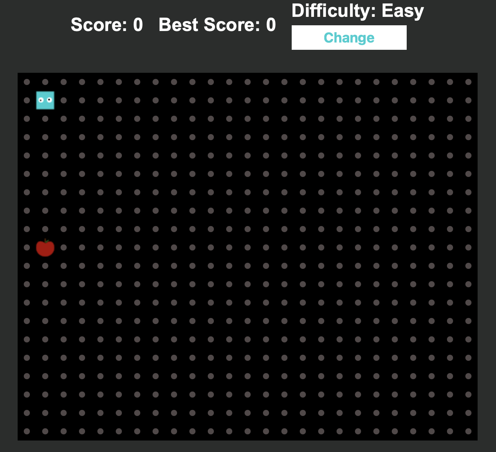
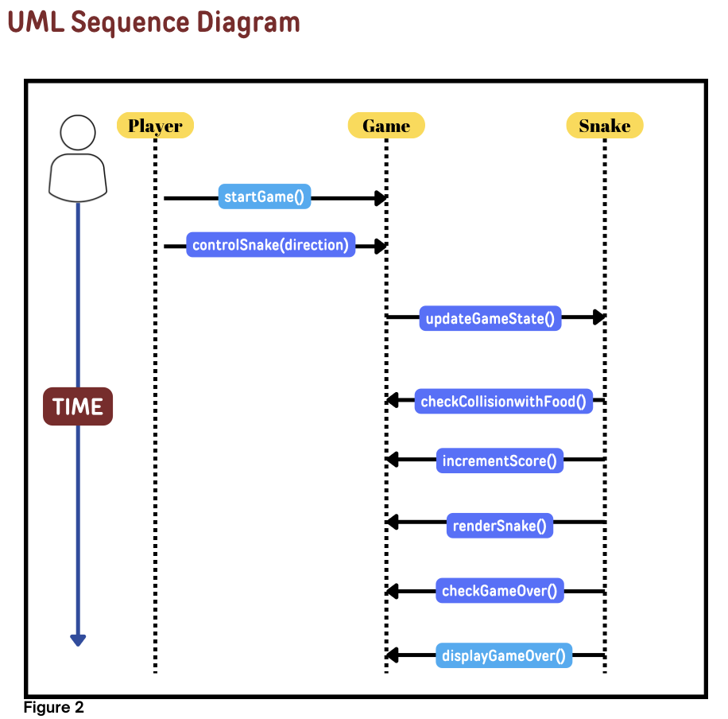

# Snake Game

#### Introduction:

This project is an example of software development aiming to modernize the classic Snake game and enhance code quality using design patterns. 
The game involves the basic Snake mechanics, where a simple snake eats food on the screen to grow in size. However, behind this simple game, there is a set of features designed and implemented in accordance with software engineering principles.

A popular game snake, writen in javascript. Works both on PC. With additional features.
- project website link : https://snakeenac.netlify.app

#### Use Design patterns: 
-Signleton Pattern
-Factory Pattern
-Observer Pattern
-Strategy Pattern

#### Additional features:
- Random food ( banana, apple, carrot, eggplant ... ).
- 2 difficulty modes ( Easy and Hard ).
- In hard mode, you can't hit borders, also a bomb can appear next to food.
- In hard mode, if you touch a bomb, your snake's length will be halved ( rounded up ).
- There are skins for the snake.
- Stores the best record in localStorage.

